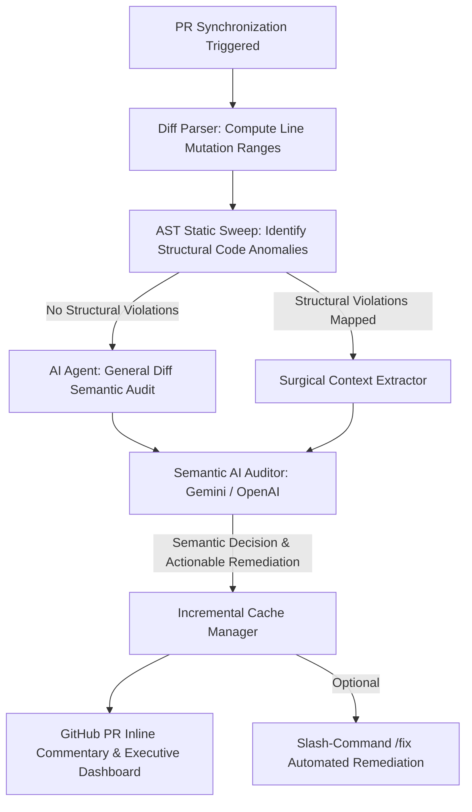

# 🛡️ PR State Bug Hunter

[]()
[]()
[]()
[]()

**PR State Bug Hunter** is a state-of-the-art, AI-powered hybrid static and semantic analysis engine designed to intercept complex asynchronous race conditions, memory leaks, lifecycle mismatches, and network framing anomalies in Pull Requests before they compromise production stability.

By orchestrating a sophisticated **dual-tier validation pipeline**, the tool merges the deterministic velocity of Babel Abstract Syntax Tree (AST) parsing with the nuanced logical cognition of Google Gemini and OpenAI models. This integration yields high-fidelity, actionable remediation recommendations with a near-zero false-positive rate.

---

## 🏗️ Architectural Blueprint

The engine operates on a robust two-layer pipeline, optimizing both computational overhead and semantic precision:



> [!NOTE]  
> **The Rationale Behind Hybrid Analysis**  
> Direct LLM processing of entire codebases introduces prohibitive token latency and financial overhead. Our pipeline bypasses this by leveraging **Babel AST walkers** to filter out structurally sound code within milliseconds. The AI engine is selectively invoked only for mutated blocks flagged with architectural weaknesses (e.g., unshielded async operations, incomplete resource tear-downs). This methodology minimizes API dependency and mitigates network latency.

---

## 🚀 Advanced Capabilities

### 1. 🏎️ Incremental Semantic Memoization (Caching)
To preserve swift developer feedback cycles and prevent redundant LLM invocations, the system employs a **cryptographically signed SHA-256 caching mechanism**.
*   **Methodology:** Each detected vulnerability generates a composite hash using the `filePath + line + ruleId + codeSnippetContext`. This signature is cached locally in `.bug-hunter-cache.json`.
*   **Efficiency:** Subsequent runs on unmodified files resolve instantaneously in **<5ms** with **0 network requests**.

### 2. 🔍 Transitive Dataflow & Taint Analysis
Standard static analysis tools frequently generate false positives due to rigid pattern matching. PR State Bug Hunter solves this through a robust scope-aware variable tracker.
*   **Transitive Cleanup Verification:** In React `useEffect` or Vue `onMounted` hooks, if an event listener's cleanup function is assigned to a variable or intermediate handler (`const cleanup = () => ...`) and subsequently returned transitively, the AST parser backtracks through the scope tree to verify the integrity of the release mechanism, successfully neutralizing false positives.

### 3. 🌐 Polyglot Framework AST Walkers (React, Svelte, Vue)
Rather than relying on basic regex string matching, the parser performs native AST transformations across multiple component paradigms:
*   **React:** Intercepts `useEffect` async anti-patterns, missing teardowns, unshielded race conditions on unmounted targets, and stale state closures.
*   **Svelte:** Parses `.svelte` file templates to isolate `<script>` blocks, detecting manual store `.subscribe` leaks neglected in `onDestroy`.
*   **Vue:** Analyzes Vue Composition API (`<script setup>`) to verify event listeners and intervals registered inside `onMounted` are systematically purged in `onUnmounted` or `onBeforeUnmount`.

### 4. 🤖 Slash-Command Automated Remediation (`/fix`)
Enables direct, closed-loop code refactoring directly from the GitHub code review interface.
*   **GitHub Comment Listener:** Submitting a comment containing `/fix` (or `/fix <line>`) on a PR triggers the action to check out the target branch, apply the AI-proposed refactoring patch, and commit the secure code changes **directly back to the repository branch**.
*   **CLI Simulation:** Developers can simulate and apply these patches locally by executing `node test-local.js --fix <line>` in their terminal.

### 5. 📊 Telemetry and Continuous Refinement
All diagnostic runs and validation metadata are recorded locally in `.bug-hunter-telemetry.json`. In GitHub environments, the action monitors developer sentiment (e.g., negative reactions like 👎) to automatically flag potential false positives, enabling data-driven refinement of the underlying semantic rules.

---

## 📋 Concurrency & State Vulnerability Catalog

The AST parser identifies structural anomalies mapped to specific concurrency rules, which are subsequently audited semantically by the AI engine:

| Rule Identifier | Target Framework | Vulnerability Signature & Concurrency Risk |
| :--- | :--- | :--- |
| **`EFFECT_DIRECT_ASYNC`** | React | `useEffect(async () => ...)` implementation. Prevents synchronous cleanup execution, exposing the component to memory leaks during rapid unmounts. |
| **`EFFECT_UNCLEANED_SUBSCRIPTION`** | React | Subscriptions, event listeners, or timers created inside `useEffect` lacking an explicit cleanup callback return. |
| **`EFFECT_UNGUARDED_ASYNC`** | React / Vue | Asynchronous operations (`fetch`/`axios`) executed without mount guards (`AbortController` or active flags), risking stale state mutation on unmounted DOM nodes. |
| **`STALE_ASYNC_STATE_UPDATE`** | React | Stale closure hazard where async resolutions write state using variables directly rather than utilizing functional state updates (`setState(prev => ...)`). |
| **`SVELTE_UNCLEANED_SUBSCRIBE`** | Svelte | Manual store subscriptions (`store.subscribe`) executed without storing the unsubscribe handler or omitting its invocation in `onDestroy`. |
| **`VUE_UNCLEANED_ONMOUNTED`** | Vue | Event listeners or intervals established in `onMounted` Composition hooks that are not systematically cleared inside `onUnmounted`. |
| **`UNFRAMED_STREAM_DATA`** | Node.js / Agnostic | Stream `data` event handlers (`socket.on('data')`) executing direct `JSON.parse` operations without handling message framing boundaries, causing crashes on split packets. |

---

## 🛠️ GitHub Actions Integration (`action.yml`)

Integrate PR State Bug Hunter into your repository CI/CD workflow by creating a `.github/workflows/bug-hunter.yml` configuration:

```yaml
name: PR State Bug Hunter

on:
  pull_request:
    types: [opened, synchronize, reopened]
  pull_request_review_comment:
    types: [created]
  issue_comment:
    types: [created]

jobs:
  analyze:
    runs-on: ubuntu-latest
    steps:
      - name: Checkout Code
        uses: actions/checkout@v4

      - name: Run Sentinel Analysis
        uses: ./ # Path to local Action or repository reference
        with:
          github-token: ${{ secrets.GITHUB_TOKEN }}
          gemini-api-key: ${{ secrets.GEMINI_API_KEY }} # Natively supports OPENAI_API_KEY
          severity-threshold: 'LOW'
          auto-comment: 'true'
          gemini-model: 'gemini-1.5-flash' # Supports gpt-4o-mini interchangeably
```

### Action Configuration Parameters (Inputs)

> [!TIP]  
> If no AI API Key is provided, the action executes a **graceful fallback mode**, skipping the semantic AI validation phase and posting raw AST warning outputs directly to the PR to maintain continuous analysis availability.

*   `github-token` (Required): The repository access token (`${{ secrets.GITHUB_TOKEN }}`) utilized to post PR suggestions and commit automated code fixes.
*   `gemini-api-key` (Optional): The credentials used for semantic validation. Accepts either Google Gemini keys or OpenAI keys (prefixed with `sk-`).
*   `severity-threshold` (Default: `LOW`): The filtering threshold for reporting vulnerabilities (`LOW`, `MEDIUM`, `HIGH`).
*   `auto-comment` (Default: `true`): Dictates whether the engine automatically submits inline review comments and summary panels.
*   `gemini-model` (Default: `gemini-1.5-flash`): The target model name used for semantic evaluation.
*   `local-ai-base-url` (Optional): Custom API base URL for Local AI models (e.g., Ollama `http://localhost:11434/v1`, LM Studio `http://localhost:1234/v1`). If set, all semantic validation calls are routed to this local endpoint.
*   `local-model-name` (Optional, Default: `llama3`): Custom model name to use when routing requests to a Local AI endpoint (e.g., `deepseek-coder`, `qwen2.5-coder`, `llama3`).

---

## 🧪 Local Execution & Development Guideline

Developers can evaluate, verify, and run the entire concurrency analysis pipeline on their local environments without pushing commits to remote branches:

### 1. Pre-requisites & Package Installation
Initialize package dependencies locally:
```bash
npm install
```

### 2. Configure Local Environment Variables
Create a `.env` file at the root of the workspace directory and specify your API credentials, or point to your Local AI setup:
```env
# For Cloud AI (Gemini or OpenAI)
GEMINI_API_KEY=YOUR_GEMINI_API_KEY
# OR: OPENAI_API_KEY=YOUR_OPENAI_API_KEY

# Alternatively, for Local AI (Ollama / LM Studio / Llama.cpp)
LOCAL_AI_BASE_URL=http://localhost:11434/v1
LOCAL_MODEL_NAME=qwen2.5-coder
```
> [!NOTE]  
> * The internal multi-provider client automatically detects the `'sk-'` prefix in `GEMINI_API_KEY` (or if you use `OPENAI_API_KEY`), seamlessly routing requests to OpenAI's REST endpoints instead of Google Gemini.
> * If `LOCAL_AI_BASE_URL` is defined, the tool operates entirely locally without sending any data to cloud services. Highly recommended for offline development or proprietary code privacy.

### 3. Run the Verification Suite
Execute the local test runner to run React, Svelte, Vue AST scans, taint tracking checks, and AI semantic cache hits:
```bash
node test-local.js
```

### 4. Execute Simulated Automated Refactoring (Auto-Fix CLI)
To test the automated patching mechanism on a specific mutated line in your mock files:
```bash
node test-local.js --fix 24
```
This command parses the component, audits the event listener leak, contacts the semantic engine for a drop-in patch, and safely merges the cleanup code back into the file.

---

## 📁 Repository Anatomy

```
pr-state-bug-hunter/
├── src/
│   ├── agents/
│   │   └── bugHunterAgent.js     # Multi-provider (Gemini/OpenAI) semantic coordinator
│   ├── analyzer/
│   │   ├── astParser.js          # Babel AST walkers and transitive taint tracker
│   │   ├── cacheManager.js       # SHA-256 cryptographic caching engine
│   │   └── diffParser.js         # Unified diff parser & changed line mapper
│   ├── github/
│   │   └── octokitClient.js      # Octokit integration for PR reviews & auto-fixes
│   └── index.js                  # Entry point for the GitHub Action (isMain guarded)
├── src/test-cases/
│   ├── buggyComponent.jsx        # React concurrency vulnerabilities & clean samples
│   ├── buggySvelte.svelte        # Svelte manual subscription leak test case
│   └── buggyVue.vue              # Vue Composition listener & interval leak test case
├── action.yml                    # GitHub Action interface declaration
├── test-local.js                 # Local test runner & CLI auto-fix simulator
├── package.json
└── README.md
```

---

## 🛡️ License

This project is licensed under the terms of the MIT License. See the LICENSE file for details.
