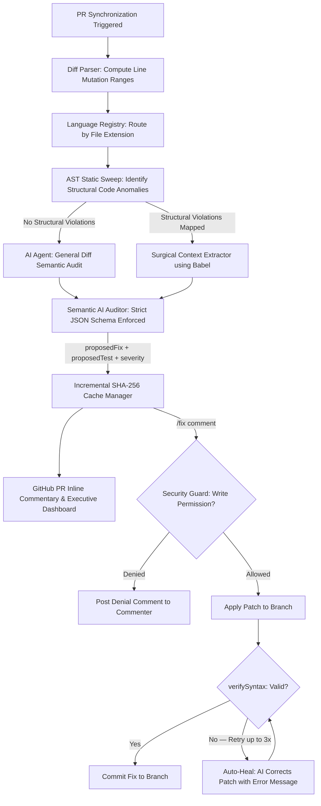

# 🛡️ PR State Bug Hunter

[]()
[]()
[]()
[]()
[]()
[]()
[]()

**PR State Bug Hunter** is a production-grade, AI-powered hybrid static and semantic analysis engine designed to intercept complex asynchronous race conditions, memory leaks, lifecycle mismatches, and network framing anomalies in Pull Requests before they compromise production stability.

By orchestrating a sophisticated **dual-tier validation pipeline**, the tool merges the deterministic velocity of Babel Abstract Syntax Tree (AST) parsing with the nuanced logical cognition of Google Gemini and OpenAI models. This integration yields high-fidelity, actionable remediation recommendations with a near-zero false-positive rate.

---

## ✨ What's New in v2.1

| Feature | Description |
|---|---|
| 🏗 **Semantic Context Extraction** | Replaced static +/- 15 lines context with a robust `@babel/traverse`-based function extraction to feed AI the precise logical boundaries of the modified code. |
| 🧩 **Strict JSON Schema Enforcement** | Upgraded Gemini and OpenAI integrations to mandate strictly typed JSON output using `responseSchema` / `json_schema` to guarantee 100% reliable data parsing and prevent hallucinations. |
| 📦 **Composite Action & Built-in Caching** | Rewrote `action.yml` as a **composite action** to natively utilize `actions/cache@v4` for persisting `.bug-hunter-cache.json` across workflow runs, accelerating subsequent builds significantly. |
| 🔐 **Slash Command Security Guard** | `/fix` commands are gated behind a GitHub Collaborator write/admin permission check. Unauthorized users receive a denial comment instead of silently failing. |
| 🔄 **AI Auto-Healing Retry Loop** | When a proposed fix introduces a syntax error, the engine re-invokes the AI with the error message and retries up to **3 times** before abandoning. |
| 🧪 **Automated Unit Test Suggestion** | Every confirmed bug report now includes a `proposedTest` field — a minimal Jest/Vitest test that **reproduces the bug** and **validates the fix**, rendered as a collapsible block in PR comments. |
| 🔌 **Pluggable Language Registry** | `languageRegistry.js` allows third-party language plugins (Python, Go, Rust…) to self-register without modifying core AST logic. JS/TS/Vue/Svelte are served via the built-in `javascriptPlugin`. |
| 🧬 **Vitest Test Suite (118 tests)** | Full unit + integration test coverage across all modules with mocked AI/GitHub APIs enforcing strict coverage thresholds (70% Statements/Functions, 55% Branches). |

---

## 🏗️ Architectural Blueprint

The engine operates on a robust two-layer pipeline, optimizing both computational overhead and semantic precision:



> [!NOTE]
> **The Rationale Behind Hybrid Analysis**
> Direct LLM processing of entire codebases introduces prohibitive token latency and financial overhead. Our pipeline bypasses this by leveraging **Babel AST walkers** to filter out structurally sound code within milliseconds. The AI engine is selectively invoked only for mutated blocks flagged with architectural weaknesses. This methodology minimizes API dependency and mitigates network latency.

---

## 📋 Vulnerability Catalog (9 AST Rules)

The AST parser identifies structural anomalies mapped to specific concurrency rules, which are subsequently audited semantically by the AI engine:

| Rule ID | Framework | Vulnerability & Concurrency Risk | Default Severity |
| :--- | :--- | :--- | :---: |
| `EFFECT_DIRECT_ASYNC` | React | `useEffect(async () => ...)` — prevents synchronous cleanup, exposing memory leaks on rapid unmounts. | 🔴 HIGH |
| `EFFECT_UNCLEANED_SUBSCRIPTION` | React | Event listeners / timers inside `useEffect` without a matching cleanup callback or mismatched handler reference. | 🔴 HIGH |
| `REACT_DIRECT_STATE_MUTATION` | React | Direct mutation of React state (e.g. `items.push(...)`) instead of using the setter function. | 🔴 HIGH |
| `SVELTE_UNCLEANED_SUBSCRIBE` | Svelte | Manual `store.subscribe()` without storing the unsubscribe handle or calling it in `onDestroy`. | 🔴 HIGH |
| `VUE_UNCLEANED_ONMOUNTED` | Vue | Listeners / intervals registered in `onMounted` not cleared in `onUnmounted` or `onBeforeUnmount`. | 🔴 HIGH |
| `UNFRAMED_STREAM_DATA` | Node.js | `socket.on('data')` with direct `JSON.parse` — crashes on split TCP packets. | 🔴 HIGH |
| `EFFECT_UNGUARDED_ASYNC` | React / Vue | `fetch`/`axios` inside effects without `AbortController` or an `isMounted` flag — stale state on unmount. | 🟡 MEDIUM |
| `STALE_ASYNC_STATE_UPDATE` | React | Async state setter called without functional updater (`setState(prev => ...)`) — stale closure hazard. | 🟡 MEDIUM |
| `UNBOUNDED_LOOP_ASYNCHRONY` | React / JS | `map`/`forEach` executing async callbacks without batching or concurrency control. | 🟡 MEDIUM |

---

## 🚀 Advanced Capabilities

### 1. 🏎️ Incremental Semantic Memoization (Caching)
Each warning generates a composite **SHA-256 hash** from `filePath + line + ruleId + codeSnippetContext`. Results are cached in `.bug-hunter-cache.json`:
- Subsequent runs on unmodified files resolve in **< 5ms** with **0 network requests**
- Cache entries include `proposedFix`, `proposedTest`, `severity`, and `cachedAt` timestamp
- `proposedTest` field is also cached and re-served without a second AI call
- **GitHub Actions Native**: Integrates via composite action seamlessly using `actions/cache@v4`.

### 2. 🔍 Transitive Dataflow & Taint Analysis
- **Scope-Aware Variable Tracking:** If a cleanup is assigned to an intermediate variable and returned transitively, the parser backtracks through the scope tree to verify the release mechanism — eliminating false positives
- **Sensitive Keyword Escalation:** Files containing terms like `creditCard`, `cvv`, `password`, `jwt`, `api_key`, `billing` automatically have their warnings escalated to **HIGH** severity
- **Import Graph Analysis:** Components imported by high-risk files (e.g. `paymentCheckoutPortal.jsx`) also receive severity escalation

### 3. 🌐 Polyglot Framework AST Walkers
Rather than regex matching, the parser performs native AST traversal across:
- **React:** `useEffect`/`useLayoutEffect` async anti-patterns, missing teardowns, unshielded race conditions, direct state mutations, stale closures
- **Svelte:** Isolates `<script>` blocks from `.svelte` files, detecting manual store `.subscribe` leaks neglected in `onDestroy`
- **Vue:** Analyzes `<script setup>` Composition API for listeners and intervals without `onUnmounted` cleanup

### 4. 🔐 Slash Command Security Guard
`/fix` commands are now protected by a collaborator permission check:
```
Comment: /fix 24
  → checkUserWritePermission('commenter-username')
  → GitHub API: GET /repos/{owner}/{repo}/collaborators/{username}/permission
  → permission ∈ { 'write', 'admin' } → proceed
  → permission ∈ { 'read', 'none' } → post denial, return
```
Non-collaborators and external users are blocked with an informative comment.

### 5. 🔄 AI Auto-Healing Retry Loop
When the AI-generated patch contains a syntax error, the engine doesn't fail silently:
1. `verifySyntax(patch, filePath)` detects the error and extracts the message
2. `generateCorrectionPatch(apiKey, brokenCode, errorMessage, model)` asks the AI to self-correct
3. The fixed patch is re-verified — this loop runs up to **3 times**
4. If all attempts fail, the PR author is notified with the specific syntax error

### 6. 🧪 Automated Unit Test Suggestion
Every AI-verified bug now includes a `proposedTest` field rendered in PR comments:

```markdown
<details>
<summary>🧪 Suggested Unit Test</summary>

```js
test('should not update state after unmount', async () => {
  const { unmount } = render(<Component />);
  unmount();
  await waitFor(() => {
    expect(mockSetState).not.toHaveBeenCalledAfterUnmount();
  });
});
```
</details>
```

### 7. 🔌 Pluggable Language Registry
Register language plugins without touching core logic:
```js
import { registerLanguagePlugin } from './src/analyzer/languageRegistry.js';

registerLanguagePlugin({
  name: 'Python Plugin',
  extensions: ['.py'],
  analyze: (code, filePath, config) => {
    // return array of { line, ruleId, message, severity }
  },
});
```
Built-in plugins: `javascriptPlugin` (handles `.js`, `.jsx`, `.ts`, `.tsx`, `.vue`, `.svelte`)

### 8. 🧠 AST-Based Context Extraction
Bypassing rudimentary +/- 15 lines slicing, Bug Hunter utilizes `@babel/traverse` to extract the full logical enclosing function of any vulnerability. This equips the AI with an exact understanding of component lifecycles, leading to dramatically enhanced reliability and structurally-sound patch generation.

---

## 🧪 Test Suite

The project ships with a full **Vitest** test suite — 118 tests across 8 files, running in **< 3 seconds** with mocked AI and GitHub APIs.

```
tests/
├── unit/
│   ├── cacheManager.test.js        (10 tests)  SHA-256 hash, round-trip, proposedTest cache
│   ├── languageRegistry.test.js    (15 tests)  Register, lookup, dedup, delegation
│   ├── astParser.test.js           (22 tests)  All 9 rules × positive+negative, verifySyntax, escalation
│   ├── bugHunterAgent.test.js      (17 tests)  Cache hits, Gemini path, OpenAI path, correction patch, Fallback scan
│   ├── diffParser.test.js          (4 tests)   Patch extraction, line-number resolution
│   ├── javascriptPlugin.test.js    (2 tests)   Plugin encapsulation
│   └── octokitClient.test.js       (28 tests)  Permission guard, proposedTest rendering, inline comments, fixes
└── integration/
    └── slashCommand.test.js        (20 tests)  applyFix, security guard, auto-heal loop, full pipeline
```

### Running Tests

```bash
# Run all 118 unit + integration tests
npm test

# Watch mode (re-runs on file changes)
npm run test:watch

# With coverage report (HTML + JSON)
npm run test:coverage

# Legacy smoke test (React/Vue/Svelte AST + AI cache)
npm run test:local
```

### Coverage Thresholds

| Metric | Threshold |
|---|---|
| Lines | ≥ 70% |
| Functions | ≥ 70% |
| Branches | ≥ 55% |
| Statements | ≥ 70% |

---

## 🛠️ GitHub Actions Integration

Add this workflow to `.github/workflows/bug-hunter.yml`:

```yaml
name: PR State Bug Hunter

on:
  pull_request:
    types: [opened, synchronize, reopened]
  pull_request_review_comment:
    types: [created]
  issue_comment:
    types: [created]

jobs:
  analyze:
    runs-on: ubuntu-latest
    permissions:
      pull-requests: write
      contents: write
    steps:
      - name: Checkout Code
        uses: actions/checkout@v4

      - name: Run PR State Bug Hunter
        uses: ./ # or: your-org/pr-state-bug-hunter@v2
        with:
          github-token: ${{ secrets.GITHUB_TOKEN }}
          gemini-api-key: ${{ secrets.GEMINI_API_KEY }}
          severity-threshold: 'LOW'
          auto-comment: 'true'
          gemini-model: 'gemini-1.5-flash'
```

### Action Inputs

> [!TIP]
> If no AI API key is provided, the action runs in **graceful fallback mode** — posting raw AST warnings directly to the PR without semantic AI validation.

| Input | Required | Default | Description |
|---|---|---|---|
| `github-token` | ✅ Yes | — | `${{ secrets.GITHUB_TOKEN }}` for PR comments and branch commits |
| `gemini-api-key` | No | — | Gemini API key (`AIza…`) or OpenAI key (`sk-…`) |
| `severity-threshold` | No | `LOW` | Minimum severity to report: `LOW`, `MEDIUM`, `HIGH` |
| `auto-comment` | No | `true` | Whether to post inline PR review comments |
| `gemini-model` | No | `gemini-1.5-flash` | AI model name (also accepts `gpt-4o-mini`) |
| `local-ai-base-url` | No | — | Base URL for Ollama / LM Studio (e.g. `http://localhost:11434/v1`) |
| `local-model-name` | No | `llama3` | Model name when using a local AI endpoint |

---

## 💻 Local Development

### 1. Install dependencies
```bash
npm install
```

### 2. Configure environment
Create a `.env` file at the project root:
```env
# Cloud AI (choose one)
GEMINI_API_KEY=your_gemini_key_here
# OPENAI_API_KEY=your_openai_key_here

# Local AI (Ollama / LM Studio)
# LOCAL_AI_BASE_URL=http://localhost:11434/v1
# LOCAL_MODEL_NAME=qwen2.5-coder
```

### 3. Configure rules (`bug-hunter.config.json`)
```json
{
  "exclude": [
    "**/node_modules/**",
    "**/dist/**",
    "**/tests/**"
  ],
  "rules": {
    "EFFECT_DIRECT_ASYNC": "on",
    "REACT_DIRECT_STATE_MUTATION": "on",
    "UNBOUNDED_LOOP_ASYNCHRONY": "on",
    "EFFECT_UNCLEANED_SUBSCRIPTION": "on",
    "EFFECT_UNGUARDED_ASYNC": "on"
  }
}
```

### 4. Run the Vitest suite
```bash
npm test
```

### 5. Run the legacy smoke test
```bash
npm run test:local
```
Executes React/Svelte/Vue AST scans, AI semantic cache, taint escalation, security guard, auto-heal, and language registry checks — all without GitHub API access.

### 6. Simulate auto-fix on a specific line
```bash
node test-local.js --fix 24
```
Parses the mock component, contacts the AI for a drop-in patch, and writes the fix back to the test file.

---

## 📁 Repository Structure

```
pr-state-bug-hunter/
├── src/
│   ├── agents/
│   │   └── bugHunterAgent.js       # Multi-provider AI coordinator + AST context extractor
│   ├── analyzer/
│   │   ├── astParser.js            # Babel AST walkers + transitive taint tracker
│   │   ├── cacheManager.js         # SHA-256 cryptographic caching engine
│   │   ├── dependencyGraph.js      # Import graph builder + high-risk taint tracker
│   │   ├── diffParser.js           # Unified diff parser + changed line mapper
│   │   ├── languageRegistry.js     # Pluggable language plugin registry
│   │   └── plugins/
│   │       └── javascriptPlugin.js # JS/TS/Vue/Svelte built-in plugin
│   ├── github/
│   │   └── octokitClient.js        # Octokit: PR comments, permission guard, auto-fix commits
│   └── index.js                    # GitHub Action entry point
├── src/test-cases/
│   ├── buggyComponent.jsx          # React concurrency vulnerabilities + clean samples
│   ├── buggySharedComponent.jsx    # Shared component for taint escalation testing
│   ├── buggySvelte.svelte          # Svelte manual subscription leak
│   ├── buggyVue.vue                # Vue Composition listener + interval leak
│   └── paymentCheckoutPortal.jsx   # High-risk importer for severity escalation
├── tests/
│   ├── unit/
│   │   ├── cacheManager.test.js    # 10 tests
│   │   ├── languageRegistry.test.js # 15 tests
│   │   ├── astParser.test.js       # 22 tests
│   │   ├── bugHunterAgent.test.js  # 17 tests
│   │   ├── diffParser.test.js      # 4 tests
│   │   ├── javascriptPlugin.test.js # 2 tests
│   │   └── octokitClient.test.js   # 28 tests
│   └── integration/
│       └── slashCommand.test.js    # 20 tests
├── action.yml                      # Composite GitHub Action + actions/cache integration
├── bug-hunter.config.json          # Default rule + exclusion config
├── vitest.config.js                # Vitest configuration + coverage thresholds
├── test-local.js                   # Legacy smoke test + CLI auto-fix simulator
├── package.json
└── README.md
```

---

## 🔒 Security Considerations

> [!WARNING]
> The `/fix` slash command requires `contents: write` permission in your workflow. Ensure your repository's branch protection rules are configured to prevent unauthorized force-pushes.

- **Permission Guard:** Every `/fix` command verifies the commenter has `write` or `admin` collaborator status via the GitHub API before touching any code
- **Syntax Verification:** All AI-generated patches are validated by `verifySyntax()` using Babel before being committed — broken patches trigger the auto-heal loop rather than corrupting the codebase
- **No Secrets in Comments:** The engine never echoes API keys or environment variables into PR comments
- **Cache Integrity:** Cache entries are keyed by SHA-256 hash of code content — cache poisoning via diff manipulation is structurally prevented
- **Strict JSON Types:** AI output schema is structurally bound avoiding prompt injection side-effects.

---

## 🛡️ License

This project is licensed under the terms of the **MIT License**. See the `LICENSE` file for details.
